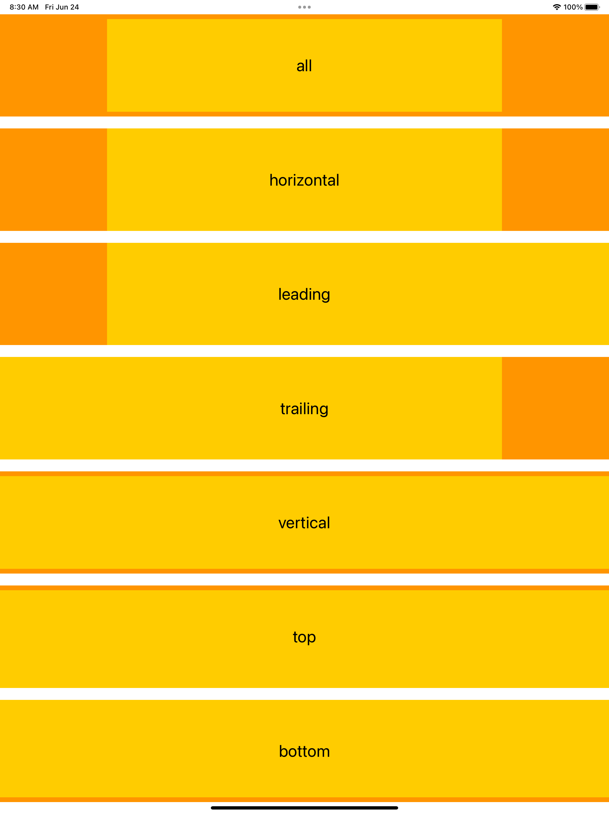

# ReadableContent

A SwiftUI view modifier to add padding to a view such that the view is enclosed by the readable content guide provided by UIKit.

## Example Usage

Using the `readableContent(_:)` modifier add padding where needed to inset the view inside the readable content guide. The following code shows how the yellow view is inset compared to the orange view, when providing different values of [`Edge.Set`](https://developer.apple.com/documentation/swiftui/edge/set).

```swift
struct ReadableContentTest: View {

  let edges: Edge.Set
  let name: String

  var body: some View {
    ZStack {
      Color.orange

      Color.yellow
        .readableContent(edges)

      Text(name)
        .foregroundColor(.black)
        .font(.title)
    }
  }
}

struct ContentView: View {
  var body: some View {
    VStack(spacing: 20) {
      ReadableContentTest(edges: .all, name: "all")
      ReadableContentTest(edges: .horizontal, name: "horizontal")
      ReadableContentTest(edges: .leading, name: "leading")
      ReadableContentTest(edges: .trailing, name: "trailing")
      ReadableContentTest(edges: .vertical, name: "vertical")
      ReadableContentTest(edges: .top, name: "top")
      ReadableContentTest(edges: .bottom, name: "bottom")
    }
  }
}
```


